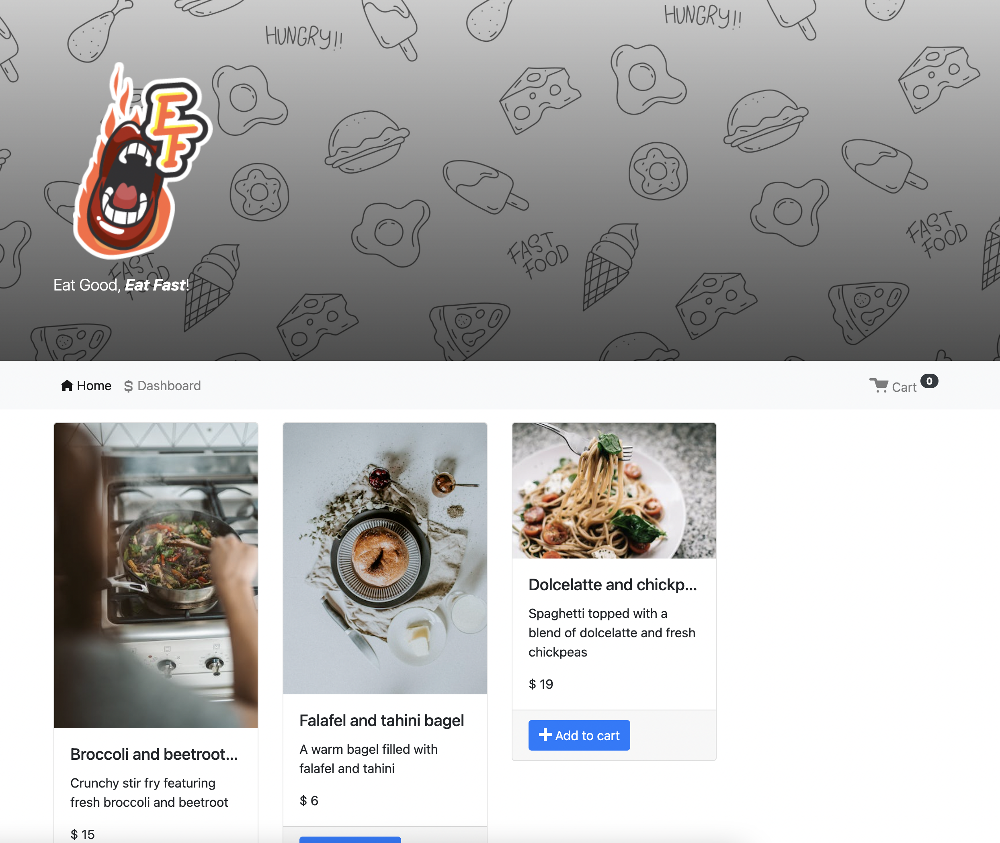

# Grub-Dash
[](https://github.com/Oscarlosg/Grub-Dash/issues) [](https://github.com/Oscarlosg/Grub-Dash/graphs/contributors) 
## Description
Grub-Dash is an app food ordering app with a client and administrator side. Both sides are easily accecible through the nav. In the app, you can view items and add them to your shopping cart where you can enter your information to order food (ps. dont use your real information please). In the administrator side, you can view and edit orders/order status and create new dishes to display in the homepage. Order up, eat up, enjoy!
          
View the deployed page at [Grub-Dash](soon).
## Contents
* [Usage](#usage)
   * [Screenshots](#screenshots)
* [Questions](#questions)

## Usage
run ```npm install``` in the root folder then change directory to the server folder and run ```npm start```. In a separate terminal, change directory to client and run ```npm start```. 
  
### Screenshots

soon

## Questions
If you have any questions about the repo, please [open an issue](https://github.com/Oscarlosg/Grub-Dash/issues) or contact me via email at oscarlosg14@gmail.com. You can find more of my work on my GitHub, [Oscarlosg](https://github.com/Oscarlosg/).
  
